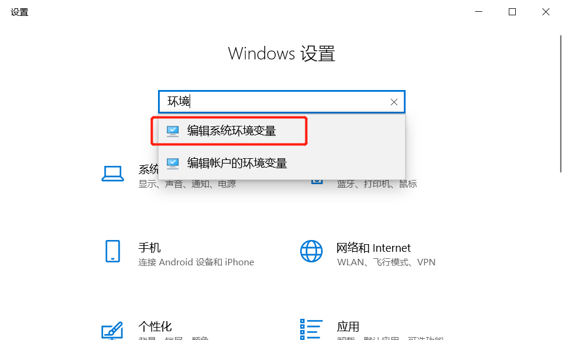
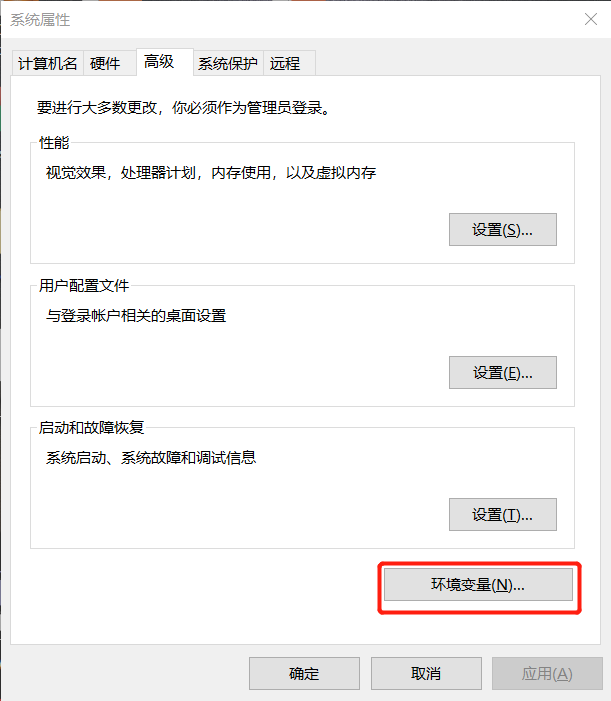
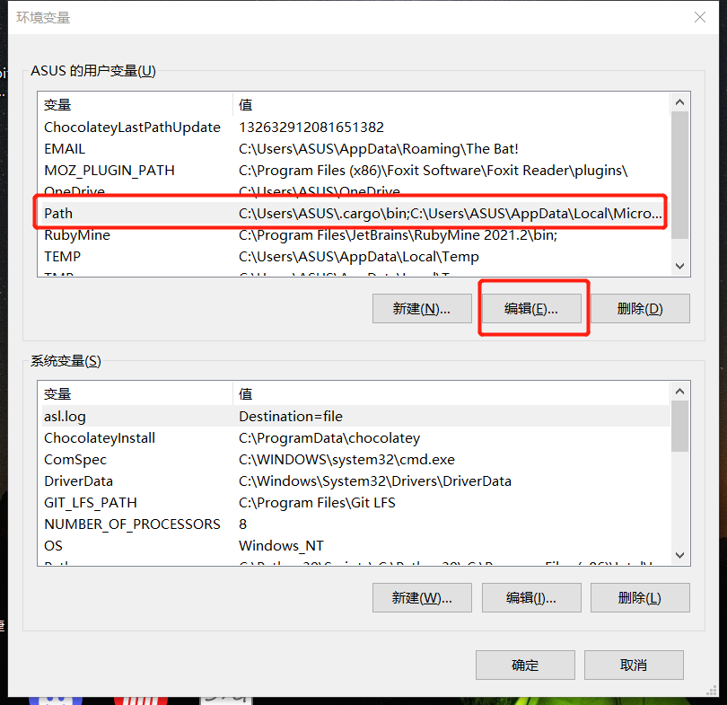
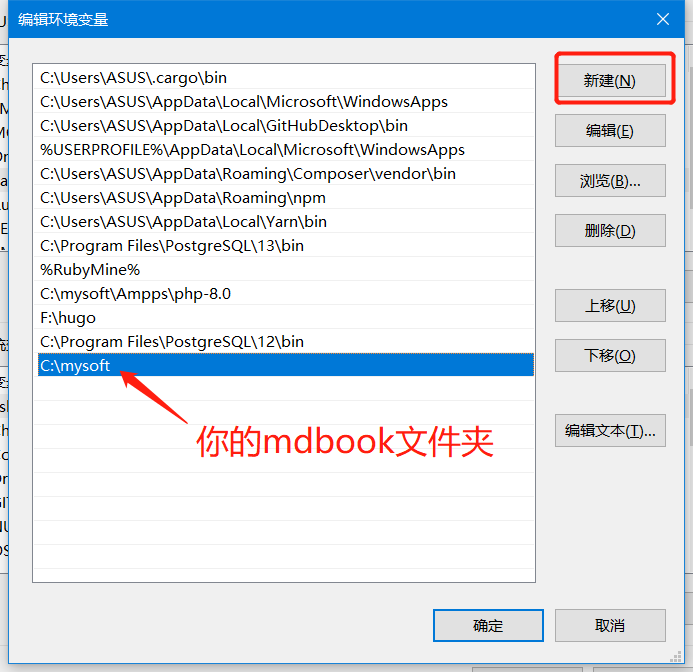
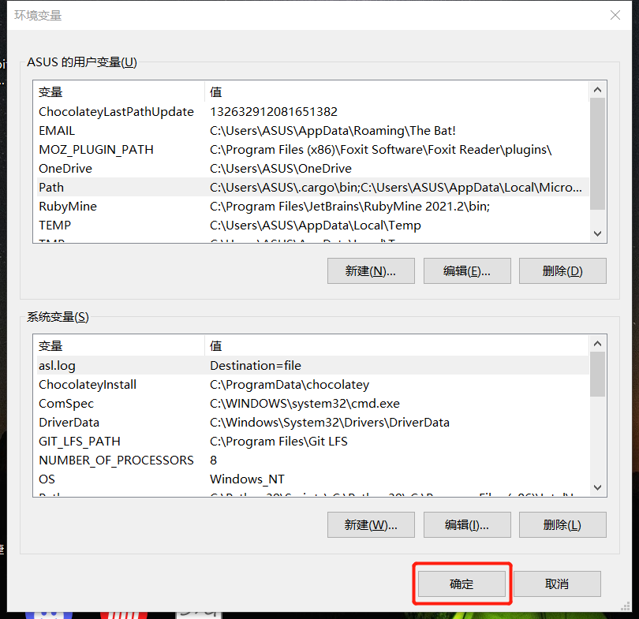
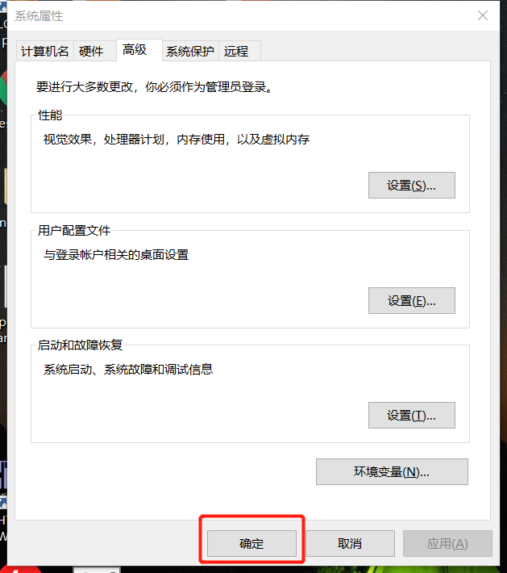

# 巴利语手册

## 安装

### vscode


### mdbook

#### 1. 下载
[download at github](https://github.com/rust-lang/mdBook/releases)

>windows用户请下载 ***windows-msvc.zip

#### 2. 解压缩

解压缩到任意文件夹

#### 3. 设置环境变量

  - windows
    - 设置->搜‘编辑环境变量’
	
	- ‘高级’->环境变量
	
	- ‘Path’->编辑
	
	- ‘新建’->输入你的 mdbook.exe所在的目录。例如： `d:/mdbook` 
	
	- 确定
	
	- 确定
	
	- 重启电脑

## 启动 mdbook

vscode 菜单->终端->新终端

键入

```
mdbook serve --open
```