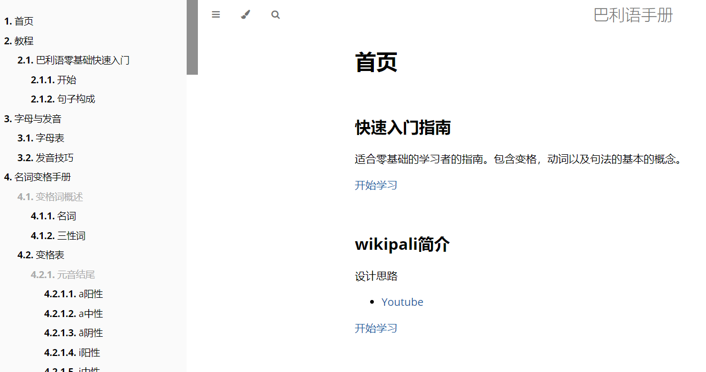

# 巴利语手册

## 安装

### vscode


### mdbook

#### 1. 下载
[download at github](https://github.com/rust-lang/mdBook/releases)

>windows用户请下载 ***windows-msvc.zip

#### 2. 解压缩

**Windows**

解压缩到c:\


## 启动 mdbook
在仓库文件夹启动集成终端

vscode 菜单->终端->新终端

或 ctl+`

键入

```
c:\mdbook.exe serve --port 3000 --hostname 192.168.2.12 --open

or

c:\mdbook.exe serve --open
```
其中：
- `--port`后面设置端口
- `--hostname`后面写自己的ip地址
浏览器会自动打开




ctrl+c 退出服务器