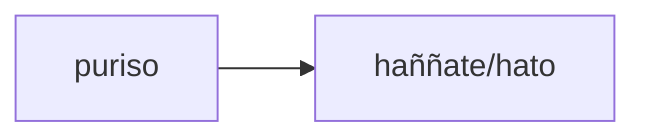
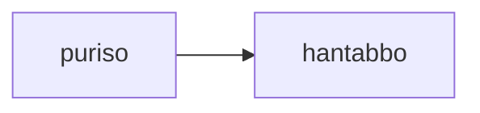

# AOV

* English： Active Object Relation
* 中文： 受動者-動詞關係（vutta）
* 巴利语： vuttakamma - kiriyā

## D.主动宾语关系

主格宾语与主要动词的被动语态相关联 

例如：puriso haññate/hato=（那个）人被杀。

```mermaid
graph LR
puriso-->haññate/hato
```   
puriso hantabbo=(那个)人应当被杀。

```mermaid
graph LR
puriso-->hantabbo
```   