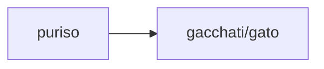

# nom-asv

[基本关系语法](basic-relation.md)&gt;[主格](nom.md)&gt;AOV

## AOV

* English： Active Object Relation
* 中文： 受動者-動詞關係（vutta）
* 巴利语： vuttakamma - kiriyā

## C.主动主语关系

主格主语与主要动词的主动语态相关联 

例如：puriso gacchati/gato=（那个）人走/已经走。

