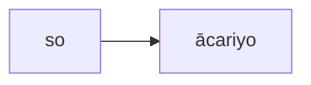
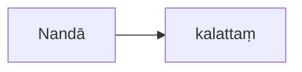
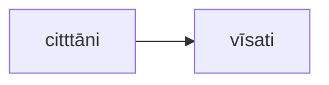
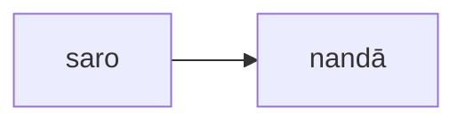

# nom-nio

[基本关系语法](basic-relation.md)&gt;[主格](nom.md)&gt;AOV

## AOV

* English： Active Object Relation
* 中文： 受動者-動詞關係（vutta）
* 巴利语： vuttakamma - kiriyā

 #  A.主格相同关系

   表示相同内容的词语必须是主格，但性与数可能会不同。这里不必有特别的时态 与语气。它又可以进一步分为两个子关系，即主格相同（普通）关系和主格相同（带 名称）关系。 

## A.1.主格相同（普通）关系

so ācariyo=他（是）老师。

 Nandā kalattaṃ=难达（是）妻子。

 citttāni vīsati=这种心分 类（数量上）。 

  

 >注：第二个例子中的性别不同，与最后一个例子中的性与数的不同，应当要标明。 
 
 ## A.2.主格相同（带名称）关系

  这类的明显之处在于不变词"nāma"意为“名为”，否则它与上一个类似。

  例如：saro nandā nāma=（这个）湖的名字叫做 Nandā。

   bhikkhuniyo saṅgho nāma=许多比库尼名为僧团。 
   ```mermaid 
graph LR
bhikkhuniyo-->saṅgho
```
 >注： 请留意第一个例子中的性别不同，第二个例子中的性与数不同。 
