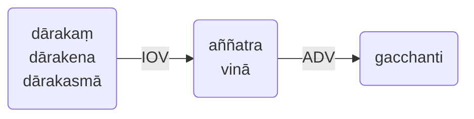

# **10. ** *aññatra / vinā*的使用 Usage of** *aññatra / vinā* 
无语尾变化的*aññatra*和*vinā*可被当作动词连续体，具有以下含义：
- 除了……之外
- 排除
- 不包括

他们的非主格受动者——排除的对象——可以是*宾格*，*工具格*或*来源格*。

The indeclinables *abbatra* and *vina* are viewed as gerunds having the sense “having excepted, having excluded, not having included”. 
Their *inactive* objects, that is, the objects excluded, can be in *accusative*, *instrumental* or *ablative* case. 

**例句**：Aññatra (Vinā) dārakaṃ/dārakena/dārakasmā sabbe manussā gacchanti. 

- **译**：除了孩子（即没有孩子），所有男人都去。
- **Trs**:All men go, having excluded the child (i.e. without the child).
