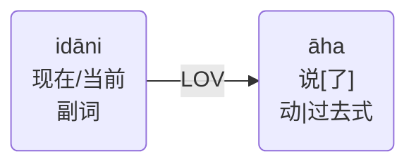

# 31. *idāni ... āha*的用法

在句子中有*idāni*存在时，
且 *āha* 在句子中做主要动词，
此时，*āha*有表达**现在时**的含义，关系如图所示：

### 例句：Evaṃ kusalaṃ dassetvā idāni akusalaṃ dassetuṃ / dassento “katame dhammā akusalā” ti āha. 

>When *āha* is used as the main verb in a sentence having *idāni* related to it in (LOV) relation, *āha* carries the sense of Present Tense. 