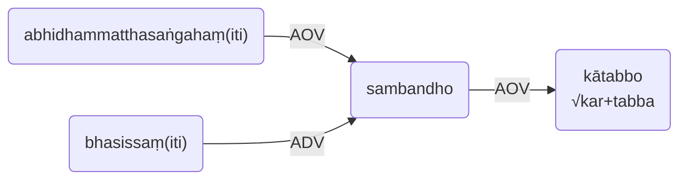
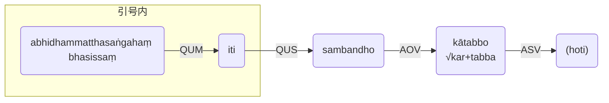

# 7. 带有 *iti sambandho* 的句型关系<br>Relations with *iti sambandho* 
当短语 *iti sambandho* 在所给的文句中使用时，它可以有三组关系以及对应的三种译法。<br>
When the phrase *iti sambandho* is used in a given sentence, it can have three sets of relations, and three kinds of translations respectively. 

例句Ex：
```
Abhivādiya bhāsissaṃ abhidhammatthasaṅgahaṃ. (被注释*commented unit*) 
abhidhammatthasaṅgahaṃ bhasissan**ti sambandho. (注释*comment unit*) 
```
## **第一组关系**<br>**1st Set of Relations**


**译**：- 单词“abhidhammatthasaṅgahaṃ”应与单词“bhāsissaṃ”的构成关联。<br>
**Trs**:- The relation of the word “abhidhammatthasaṅgahaṃ” with the word “bhāsissaṃ” should be made. 

## **第二组关系**<br>**2nd Set of Relations** 



**译**：单词"abhidhammatthasaṅgahaṃ"应该与单词"bhāsissaṃ"相关联。<br>
**Trs**：The word “abhidhammatthasaṅgahaṃ” should be related with the word “bhāsissaṃ”. 

## **第三组关系**<br>**3rd Set of Relations**


**译**：关系（应被做出）/（是）因此，"（我）将阐述（著作叫） *abhidhammatthasavgaha*"。<br>
**Trs**：The relation (ought to be made) / (is) thus, “ (I) will expound (the treatise 
called) *abhidhammatthasavgaha*”. 
 


