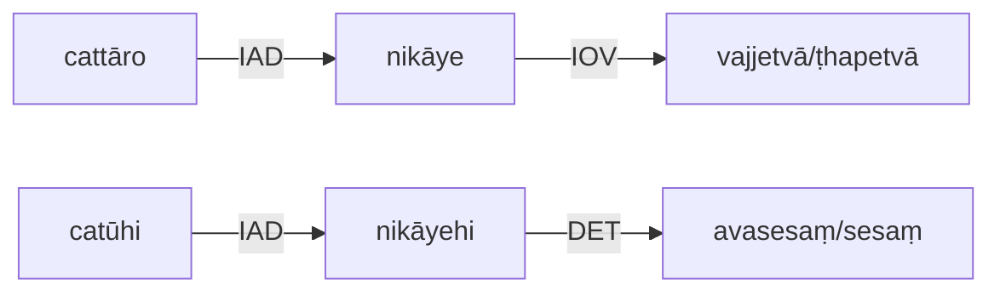

# **9. *añña/ sesa (avasesa) ...vajjetvā / ṭhapetvā* 的用法 Usage of** *añña/ sesa (avasesa) ...vajjetvā / ṭhapetvā*

The *inactive* object of *vajjetvā / ñhapetvā* is changed into a form of *ablative* case and inserted to be related to *abba / sesa* in DET relation. 

**非主格受动者/宾格**与*vajjetvā / ṭhapetvā*的动宾短语，
可以转化为**来源格**与*añña/ sesa*连用形成的短语，其关系为DET(离-开)关系。

**例句**： 
Khuddakanikāyo nāma cattāro nikāye vajjetvā / ṭhapetvā buddhavacanam. 
Khuddakanikāyo nāma cattāro nikāye catūhi nikāyehi avasesaṃ / sesaṃ buddhavacanam.

**译**：小部（*Khuddakanikāya*）是除了四部（*nikāya*）之外的佛陀的教導。 
**Trs**. *Khuddakanikāya* is, indeed, four *nikāya*s not having been taken into account, the Buddha’s teaching other (than four *nikāya*s). 

