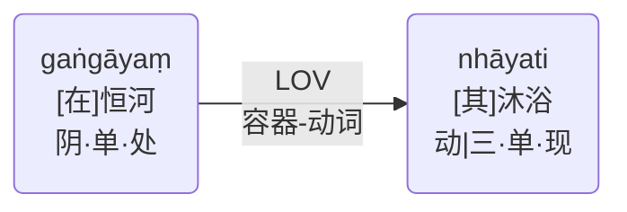
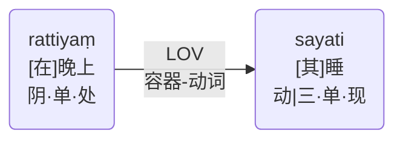

# 容器-动词

* 巴利： ādhāra - ādheyya
* 中文： 容器-动词(LOV)
* English：Locus - Verb Relation (LOV)

在这里，表达空间或时间点的名词与动词相关，动词表示在那里或那时发生的动作。有时，它与位于那里或那时的实体有关。

Here a noun expressing a point in space or time is related to a verb, which denotes the action that takes place there or then. Sometimes, it is related to an entity situated there or then.

gaṅgāyaṃ nhāyati
- 沐浴**在**恒河（河）**中**。
- bathes **in** the Ganges (river).

rattiyaṃ sayati 
- **在**晚上睡觉。
- sleeps **at** night.
