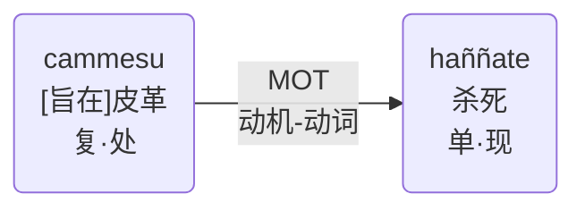

# 动机-动词
* 巴利：nimitta - nimittavant
* 中文：动机-动词
* English：Motivational Relation(MOT)

在这里，表达一种强迫行动的动机或理由的名词与表示行动本身的动词有关。

Here a noun expressing a sort of motive or grounds that compels an action is related to a verb denoting the action itself.

cammesu haññate.
- [旨在]皮革而被杀死。
