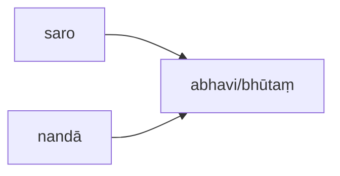

# nom-dasd

[基本关系语法](basic-relation.md)&gt;[主格](nom.md)&gt;AOV

## AOV

* 巴利语： vuttakamma - kiriyā
* 中文： 受動者-動詞關係（vutta）
* English： Active Object Relation

# 双主动主语关系

两个表示相同内容的名词一起称为“主动主语”，与主要动词是、存在的意 思相关联。两个主动主语必须是主格，但性与数可能不同。此类也可进一步分为两个 子类。 

## B.2.双主动主语（带名称）关系

使用这种替代了以上的 **A.2.** 类型，来表达特定的时态或语气。 

例如：saro nandā nāma abhavi/bhūtaṃ（那个）湖曾名为Nandā。

 
 以上句中，saro是首要的主动主语，而nandā是次要的主动主语，动词明确地表 达过去时。 
 
 当首要和次要主动主语（普通或带名称）的性或数不同时，动词必须与首要主动 主语一致。过去分词词干bhūta是中性，因为首要主动主语（saro（< saras））是中性的。 