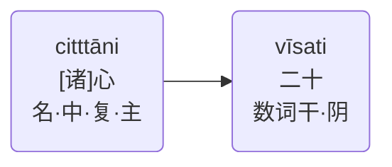

# A.主语-表语关系

两个相关联的词语：
- 表示相同内容的
- 必须是主格[^1]，但性与数可能会不同

>这里不必有特别的时态与语气。

它又可以进一步分为两个子关系，即主语-表语（普通）关系和主语-表语（带名称）关系。

---
[^1]:仅针对完整的句子或独立从句

---

## A.1.主语-表语（普通）关系

|语种|名称|
|-|-|
|巴利语|tulyattha-liṅgattha|
|中文|主语-表语（普通）|
|English|Nominal Identity (Ordinary) Relation|

so ācariyo=他（是）老师。

> 该例句中：**性**、**数**、**格**相同

---

Nandā kalattaṃ=难达（是）妻子。

> 该例句中：**性**不同
---

citttāni vīsati=心（有）20种。

> 该例句中：**性**与**数**不同
