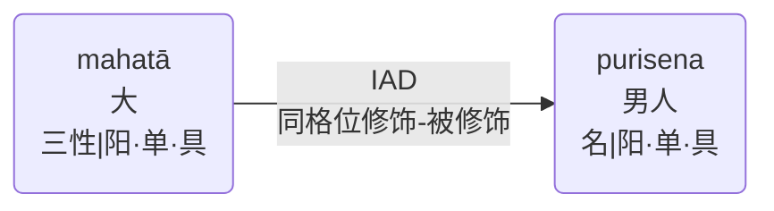
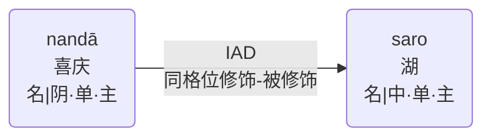
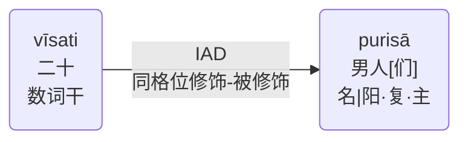

# 同类修饰

|语种|内容|
|-|-|
|巴利|tulyādhikaraṇavisesana - visesya|
|缩写|IAD|
|中文|同格位修饰-被修饰|
|英文|Identical Adjective relation|

名词当成形容词来用，与被它所修饰的名词相关联。大多数情况下，修饰词与被修饰词的**性、数、格**完全一致，但个别情况下，存在**性**与**数**的不同。 
Here a noun in adjectival use is related to a noun it modifies.
The adjective must follow the case of the substantive but may differ in gender and number.

例句：mahatā purisena
- 被一个伟人
- ...with (a/ the) great man

例句：nandā nāma saro
- 名为“nandā”的湖
- (the) lake Nandā by name

例句：vīsati purisā
- 二十位男人
- twenty men
