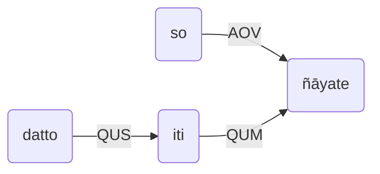

# 不变词iti
## iti结尾的引号用作 Quotations that end in iti

|缩写|巴利|中文|英文|
|-|-|-|-|
|QUS|nidassetabba - nidassana|被引用 → 引号|Quoted Speech Relation|
|QUM|nidassana - nidassanavant|引号 → 有引用|Quotation Marker relation|

引号作用：对于一个词语或者多个词语，
口头说的或者心里想的（内容）被引用。
辨认的标识是放在句末的不变词iti。 
A quotation can be defined as the citation of a word or words, spoken or thought of.
It can be recognized by the indeclinable iti, which is added to the end of it.

### A. 可大致分为两种情况： It can be dealt in two ways.

#### A1. 
把整个引文看作是一个名词，并以引语关系与iti关联起来。
而iti本身则以引号关系与相应的动词相关联。
引语本身可译或不译出来。
The whole set of quoted words is viewed as a single noun and related to "iti" in Quoted Speech Relation (QUS) and "iti" itself related to a corresponding verb in Quotation Marker relation (QUM).
The quoted speech itself may be translated or not.

例句：puriso gacchati iti so vadati / cinteti.
- 他在说/想 “*puriso gacchati*”。
- He says / thinks as, "puriso gacchati" (untranslated)
- 他在说/想：“（那个）人走了。”
- He says / thinks as, "He goes" (translated).

flowchart LR
A("puriso")
B("gacchati")
C("iti")
D("vadati/cinteti")
subgraph iti
A--"ASV"-->B
direction LR
end
iti--"QUS"-->C
C--"QUM"-->D

例句：so datto iti ñāyate
- 他以Datta（之名）被人所知。
- He is known as Datta.

#### A2.
可把引文与iti当作一个**粘音词**。这个整体是一个**无词尾变化**的名词。
其**格位**可以模拟7个格中的任何一个（呼格除外），而且根据上下文中可以推知它是引文。
The set of quoted words may be viewed as a single noun stem which is combined with iti to form a compound.
The result is an indeclinable noun.
Its case may be one of the seven cases (the Vocative is excluded) and should be inferred from the context.

例句：puriso gacchati iti so vadati / cinteti.
- He says (the words) / thinks of (the words), "puriso gacchati".
- He says (the words) / thinks of (the words), "He goes".

flowchart LR
A("“Puriso gacchati”iti")
B("vadati / cinteti")
A--"IOV"-->B

例句：so "datto" iti ñāyate.
- = 他（的名字）叫“*datta*”而为人所知。
- He, who is (named) Datta, is known.

flowchart LR
A("so")
B("ñāyate")
C("“datto”iti")
A--"AOV"-->B
C--"IAD"-->A

B. Sometimes, the initial part only, one word or more, of the whole speech is quoted.
In this case, the quoted portion cannot be translated. 

Ex. "Puriso maggaṃ gacchati" may be quoted as "puriso iti". 

Then it can be translated only as "puriso, etc." or "the words 'puriso, etc'."

## 列举 Enumeration
When items belonging to a class are enumerated, each noun denoting an item is related to "iti" in enumerative relation (ENU).
And "iti" itself is related, in enumeration marker Relation (ENM), to the numeral that qualify the noun denoting the class.

例句：Buddhassa, Dhammassa, Sanghassa ca iti tiṇṇaṃ rattanānaṃ ahaṃ namāmi.
- 我皈依三宝，即佛、法与僧。
- I pay homage to Three Gems, that is / namely, Buddha, Dhamma and Sangha.

flowchart LR
A("buddhassa")
B("dhammassa")
C("saṅghassa")
D("iti")
E("tiṇṇaṃ")
A--"ENU"-->D
B--"ENU"-->D
C--"ENU"-->D
D--"ENM"-->E

The nouns denoting enumerated items generally carry the case of the numeral qualifying the class.
But they sometimes carry the Nominative case.
Sometimes, iti is not expressed but to be known by implication.
例句：Buddhassa, Dhammassa, Sanghassa ca tiṇṇaṃ rattanānaṃ ahaṃ namāmi.
- I pay homage to Three Gems, (that is / namely) Buddha, Dhamma and Sangha.

## 原因状语Causative particle
例句：putto gacchati iti matā rodati
- Mother cries because the son goes.

flowchart LR
B("rodati")
C("putto")
D("gacchati")
subgraph iti
direction LR
C--"ASV"-->D
end
iti--"CAU"-->B

The marker of the end of a theme, a topic, a chapter, etc.

例句：Kim putto gacchati iti? na gacchati. So ghare hoti iti
- Does the son go? (He) does not go. He is at home.
